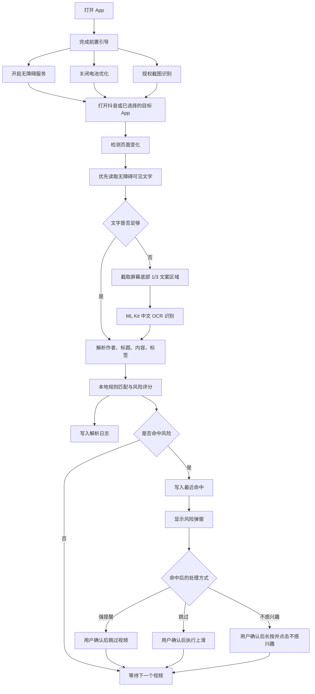
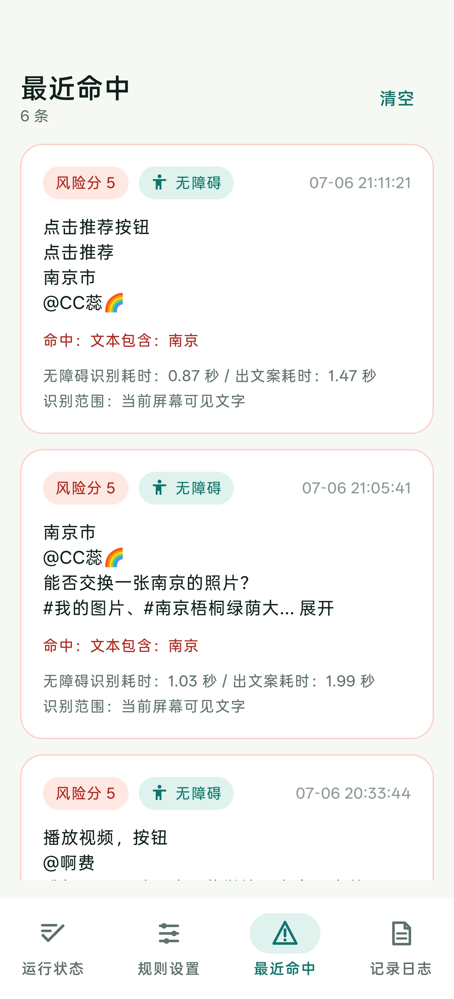

# 抖音-老年人模式

## 设计目的

`抖音-老年人模式` 是一款面向家人自用场景的 Android 辅助 App。它的目标不是替代短视频平台，也不是自动判断事实真伪，而是在老人刷抖音时，对疑似 AI 营销、虚假教程、引流进群、免费领取资料、一键变现等高风险内容进行本地识别，并用醒目的弹窗提醒用户谨慎操作。

项目当前是原型验证版本，只处理屏幕上已经可见的文字内容：

- 不调用抖音私有接口
- 不抓包、不逆向、不读取登录态
- 不读取后台隐藏标签
- 不上传截图、OCR 文本、命中记录或日志
- 识别、规则匹配和日志存储都在本机完成

## 工作流程



## 权限说明

| 权限或能力 | 用途 | 说明 |
| --- | --- | --- |
| 无障碍服务 | 读取目标 App 当前屏幕可见文字，显示无障碍悬浮提醒，执行用户确认后的手势动作 | 默认只用于已选择的 App，抖音默认选中 |
| 屏幕捕获 MediaProjection | 当无障碍文本不足时，截图并进行本地 OCR 识别 | 只截取屏幕底部 1/3 文案区域，降低耗时和耗电 |
| 前台服务 | Android 14+ 使用屏幕捕获时需要前台服务 | 通知栏会显示正在识别 |
| 通知权限 | 显示前台服务通知 | Android 13+ 需要用户授权 |
| 忽略电池优化 | 降低系统清理后台服务的概率 | 用于提高连续刷视频时的稳定性 |

## App 主要功能

- 支持 Android 13 到 Android 17，`minSdk = 33`，`targetSdk = 37`。
- 默认监听抖音和抖音极速版，也支持在 App 选择器中添加其它 App。
- 支持三种识别方案：自动、无障碍坐标、OCR 坐标。
- 优先通过无障碍服务读取当前页面可见文字。
- 当无障碍文本不足时，使用 MediaProjection 截图，并通过 ML Kit 中文 OCR 识别屏幕底部文案区域。
- 解析每个视频的作者、标题、内容、标签、识别耗时、出文案耗时和识别范围。
- 支持内置风险规则，例如 AI 赚钱、免费领取、进群、一键变现、虚假教程等表达。
- 支持自定义命中规则：标题包含、标签包含、文本包含。
- 命中后支持三种处理方式：强提醒、跳过、自动点击不感兴趣。
- 支持自定义弹窗提醒文案、警告框大小和风险字体大小，默认风险字体为 `42sp`。
- 支持最近命中、解析日志、操作日志。
- 解析日志和操作日志支持展开、收起、清空。
- 日志使用 SQLite 本地存储，默认自动保留 7 天。

## 用到的技术

- Kotlin
- Jetpack Compose
- Android AccessibilityService
- Android MediaProjection
- ML Kit Chinese Text Recognition bundled model
- SQLite
- Android Foreground Service
- Gradle / Android Gradle Plugin

核心 OCR 依赖：

```kotlin
implementation("com.google.mlkit:text-recognition-chinese:16.0.1")
```

工程配置：

```kotlin
namespace = "com.xyz.aitool"
applicationId = "com.xyz.aitool"
compileSdk = 37
minSdk = 33
targetSdk = 37
```

## Debug 模式的作用

Debug 模式默认开启，主要用于排查识别、跳过和自动点击“不感兴趣”的问题。它会增加一些可见日志和测试按钮，方便在真机上判断是哪一步没有生效。

Debug 模式开启后：

- 风险弹窗底部会显示命中的规则和手势测试按钮。
- 操作日志会记录更多排查信息，例如当前 Activity、OCR 触发判断、识别方案评分、自动跳过步骤等。
- 方便比较“上滑短”“上滑长”“节点滚动”等不同跳过方式是否可用。

Debug 模式关闭后：

- 风险弹窗更简洁，只保留给老人看的主要提醒和确认按钮。
- 减少排查日志写入，日常使用更清爽。

## 系统页面截图

<table>
  <tr>
    <td align="center"><strong>前置引导</strong></td>
    <td align="center"><strong>规则设置</strong></td>
  </tr>
  <tr>
    <td></td>
    <td></td>
  </tr>
  <tr>
    <td align="center"><strong>App 选择器</strong></td>
    <td align="center"><strong>自定义命中规则</strong></td>
  </tr>
  <tr>
    <td></td>
    <td></td>
  </tr>
  <tr>
    <td align="center"><strong>最近命中</strong></td>
    <td align="center"><strong>最近命中记录</strong></td>
  </tr>
  <tr>
    <td></td>
    <td></td>
  </tr>
  <tr>
    <td align="center"><strong>记录日志</strong></td>
    <td align="center"><strong>风险弹窗</strong></td>
  </tr>
  <tr>
    <td></td>
    <td></td>
  </tr>
</table>

## 如何自己单独构建运行

### 环境要求

- Android Studio
- JDK 17 或更高版本
- Android SDK Platform 37
- Gradle 9.6.1 或兼容版本
- Android 13+ 真机或模拟器

当前仓库没有提交 Gradle Wrapper，需要使用本机已安装的 Gradle。

### Android Studio 运行

1. 使用 Android Studio 打开项目根目录。
2. 等待 Gradle Sync 完成。
3. 连接 Android 13+ 手机，并开启 USB 调试。
4. 选择 `app` 配置。
5. 点击 Run 或 Debug 安装到手机。
6. 首次打开后按引导开启无障碍、关闭电池优化、授权截图识别。

### 命令行构建

Windows PowerShell 示例：

```powershell
$env:JAVA_HOME='D:\DevSoft\JetBrains\Toolbox\apps\Android Studio\jbr'
$env:ANDROID_HOME='D:\DevSoft\Android\SDK'
$env:ANDROID_SDK_ROOT='D:\DevSoft\Android\SDK'
$env:PATH="$env:JAVA_HOME\bin;$env:ANDROID_HOME\platform-tools;$env:ANDROID_HOME\cmdline-tools\latest\bin;$env:PATH"

& 'D:\DevSoft\VersionControl\Gradle\gradle-9.6.1\bin\gradle.bat' testDebugUnitTest assembleDebug
```

如果你的 Gradle 已经在 `PATH` 中，也可以直接执行：

```bash
gradle testDebugUnitTest assembleDebug
```

Debug APK 输出位置：

```text
app/build/outputs/apk/debug/app-debug.apk
```

安装到已连接手机：

```bash
adb install -r app/build/outputs/apk/debug/app-debug.apk
```

也可以推送到手机下载目录后手动安装：

```bash
adb push app/build/outputs/apk/debug/app-debug.apk /sdcard/Download/抖音-老年人模式-debug.apk
```

## License

当前暂未指定开源协议。推送到公开仓库前，建议补充 `LICENSE` 文件。
