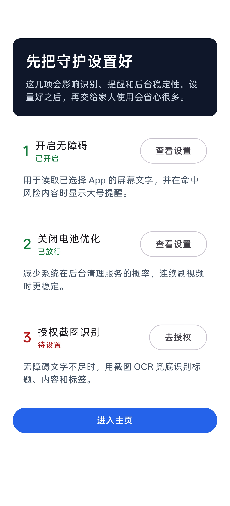
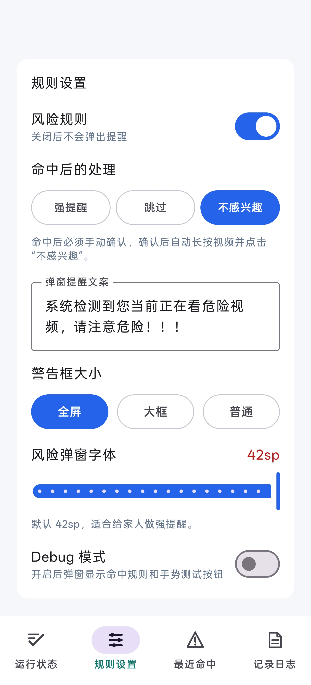
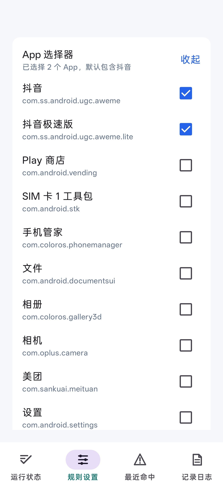
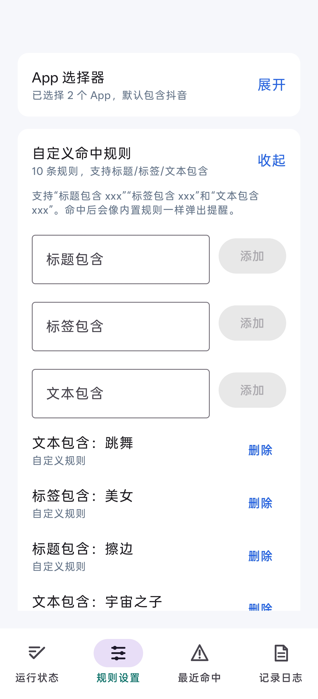
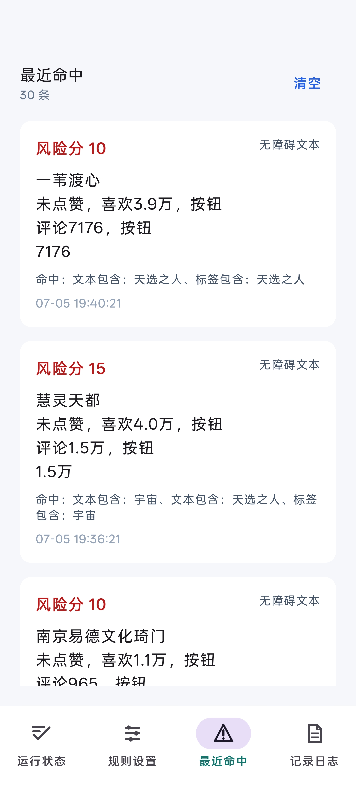
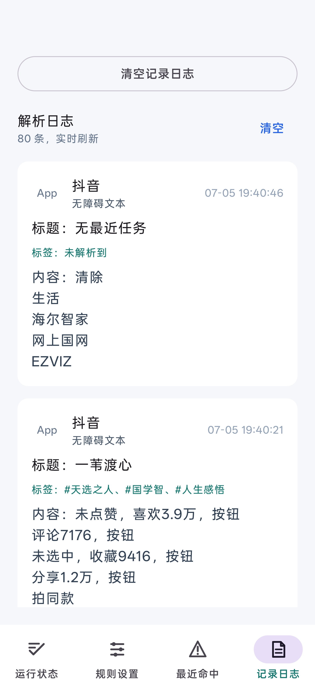

# AI 视频提醒助手

一款给家人自用的 Android 辅助 App，用来在刷短视频时识别疑似 AI 营销、虚假教程、引流进群等内容，并用醒目的弹窗提醒用户注意风险。

项目当前是原型验证版本：不接入抖音接口、不抓包、不逆向、不读取登录态或后台隐藏标签，只处理屏幕上已经可见的文字内容。

## 截图

<table>
  <tr>
    <td align="center"><strong>前置引导</strong></td>
    <td align="center"><strong>规则设置</strong></td>
  </tr>
  <tr>
    <td></td>
    <td></td>
  </tr>
  <tr>
    <td align="center"><strong>App 选择器</strong></td>
    <td align="center"><strong>自定义命中规则</strong></td>
  </tr>
  <tr>
    <td></td>
    <td></td>
  </tr>
  <tr>
    <td align="center"><strong>最近命中</strong></td>
    <td align="center"><strong>记录日志</strong></td>
  </tr>
  <tr>
    <td></td>
    <td></td>
  </tr>
  <tr>
    <td align="center"><strong>风险弹窗</strong></td>
    <td align="center"><strong>强提醒效果</strong></td>
  </tr>
  <tr>
    <td></td>
    <td>命中风险内容后，可显示全屏、大框或普通尺寸的警告弹窗；强提醒模式需要用户手动确认。</td>
  </tr>
</table>

## 主要功能

- 支持 Android 13 到 Android 17，`minSdk = 33`，`targetSdk = 37`。
- 默认监听抖音和抖音极速版，也可以在 App 选择器中选择其它 App。
- 优先通过无障碍服务读取当前页面可见文字。
- 当无障碍文本不足时，使用 MediaProjection 截图，并通过 ML Kit 中文 OCR 识别屏幕底部文案区域。
- 支持标题、标签、全文三类自定义命中规则。
- 支持内置风险规则，例如 AI 赚钱、免费领取、进群、一键变现、虚假教程等高风险表达。
- 命中后支持三种处理方式：强提醒、跳过、自动点击不感兴趣。
- 支持自定义弹窗文案、弹窗大小和风险字体大小，默认风险字体为 42sp。
- 支持最近命中、解析日志和操作日志，日志使用 SQLite 本地存储。
- 日志默认保留 7 天，并提供清空按钮。

## 工作流程

1. 用户在引导页开启无障碍权限、关闭电池优化，并授权截图识别。
2. App 只监听用户选择的目标 App，默认包含抖音。
3. 页面变化后，先读取无障碍可见文本。
4. 文本不足时，截取屏幕底部约 1/5 区域进行 OCR。
5. 将识别结果解析成标题、内容、标签。
6. 使用本地规则计算风险分并记录日志。
7. 命中风险后显示弹窗提醒，并按用户设置执行后续动作。

## 权限说明

| 权限/能力 | 用途 |
| --- | --- |
| 无障碍服务 | 读取目标 App 当前屏幕可见文字，显示无障碍悬浮提醒，并执行用户选择的手势动作 |
| 屏幕捕获 | 当无障碍文本不足时，截图并进行本地 OCR 识别 |
| 前台服务 | Android 14+ 使用 MediaProjection 时需要前台服务 |
| 通知权限 | 前台服务通知 |
| 忽略电池优化 | 降低系统清理后台服务的概率 |

## 隐私边界

这个项目按“家人自用/原型验证”设计，默认遵守以下边界：

- 不调用抖音私有接口。
- 不抓包、不逆向、不读取登录态。
- 不读取后台隐藏标签，只识别屏幕可见内容。
- 不上传截图、OCR 文本、命中记录或日志。
- 识别、规则匹配和日志存储都在本机完成。

## 技术栈

- Kotlin
- Jetpack Compose
- Android AccessibilityService
- Android MediaProjection
- ML Kit Chinese Text Recognition bundled model
- SQLite
- Gradle / Android Gradle Plugin

核心依赖：

```kotlin
implementation("com.google.mlkit:text-recognition-chinese:16.0.1")
```

## 构建运行

推荐使用 Android Studio 打开项目并直接运行 `app`。

环境要求：

- Android Studio
- JDK 17 或更高版本
- Android SDK Platform 37
- Gradle 9.6.1 或兼容版本
- Android 13+ 真机或模拟器

命令行构建：

```bash
gradle assembleDebug
```

调试包输出位置：

```text
app/build/outputs/apk/debug/app-debug.apk
```

## 使用步骤

1. 安装 App。
2. 按引导开启无障碍服务。
3. 按引导关闭电池优化。
4. 授权截图识别。
5. 在规则设置里确认要监听的 App。
6. 根据需要添加自定义规则。
7. 打开短视频 App，命中风险内容时会弹出提醒。

## 当前限制

- 第一版主要用于家庭场景和原型验证，尚未按应用商店上架审核标准打磨。
- OCR 只识别屏幕底部文案区域，以减少耗时和性能开销。
- 自动点击“不感兴趣”依赖目标 App 当前菜单布局，目标 App 改版后可能需要调整。
- 风险判断基于本地规则，不等同于事实核查或法律判断。

## License

当前暂未指定开源协议。推送到公开仓库前，建议补充 `LICENSE` 文件。
